# ☂️ Umbrella: A Plugin-Based React Native App with Sandboxed Execution

A modular **React Native** application featuring a **plugin-based architecture** that allows dynamic downloading and execution of JavaScript plugins in a secure **Node.js sandbox**.

This project is designed for **extensibility, security, and scalability**, making it easy to add new functionalities without modifying the core codebase.

---

## 🔥 Features

- **Plugin System** 🧩: Dynamically download and execute JavaScript plugins through the package [nodejs-mobile-react-native](https://github.com/nodejs-mobile/nodejs-mobile-react-native) and through the package [vm2](<[https://github.com/nodejs-mobile/nodejs-mobile-react-native](https://github.com/patriksimek/vm2)>).
- **Sandboxed Execution** 🛡️: Secure Node.js environment for running untrusted code.
- **CLEAN + MVVM Architecture** 🏗️: Maintainable and scalable design pattern.
- **Web Scraping Support** 🌐: Utilize `Node.js`.
- **State Management**: Utilize [zustand](https://github.com/pmndrs/zustand) for storing, managing, and persisting state.
- **Integration with external apps through intents**: Using Intents to open external apps like MX Player to handle different the media types supported.
- **Material Design 3 Inspired UI**: Using components from [react-native-paper](https://github.com/callstack/react-native-paper).

---

## 🚧 Planned Features

### **I'm actively working on expanding the functionality of this project! Here are some exciting features in the pipeline:**

1. Advanced Plugin Capabilities

- Support for external modules inside sandbox ✅.
- Plugin versioning system to allow updates while maintaining backward compatibility.
- Allow loading plugins through a link without the browser.

2. Unimplemented In-App Screens

- Create layout and logic for displaying categories and choosing sources on Home feature.
- Create persisted store and CRUD logic for saving the info of items from different sources in the Library feature ✅.
- Create settings that users can edit to customize their Umbrella experience.

3. UI & UX Improvements

- Add more info support to the [CategorySwiperItem.tsx](src/features/search/presentation/components/CategorySwiper/CategorySwiperItem.tsx).
- Improve support for displaying optional fields for details feature's Screen in [DetailsNavigator.tsx](src/features/details/DetailsNavigator.tsx).
- Add FAB to Plugins Screen for adding plugins through link from inside the app.

4. Security & Performance Enhancements

- Stricter sandboxing with limited permissions for plugin execution.
- Performance optimizations for faster plugin execution and reduced memory usage.
- Encrypted plugin storage to protect against unauthorized modifications.

5. General Improvements

- Reduce app size (apk).
- Verify IOS support (I don't have a MacOS device, but will try to find someone who does).

6. Testing

- Write tests to ensure expected functionality for different parts of the app..
- Make sure app is responsive 🔨.
- Ensure performance on different network speeds and device specs.

7. Local Profiles

- Allow users to have separate state for different users ✅.
- Sync through link, QR code, or id,

8. Compatability

- Check for and implement IOS, Android TV, Firestick, Windows, and web support.
- Ensure Design Responsiveness 🔨.

---

## 📸 Screenshots

| Splash Screen                                                                                            | Plugin List (No Plugins)                                                                             | Install Plugin Dialog                                                                      | Plugin Info Screen                                                                           |
| -------------------------------------------------------------------------------------------------------- | ---------------------------------------------------------------------------------------------------- | ------------------------------------------------------------------------------------------ | -------------------------------------------------------------------------------------------- |
| 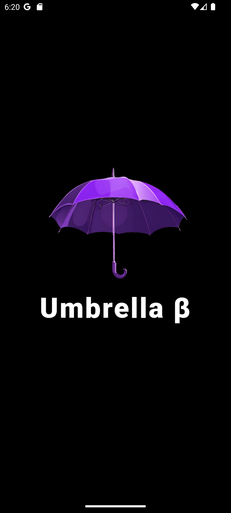                              | 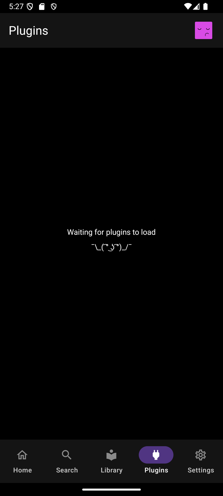          |    | 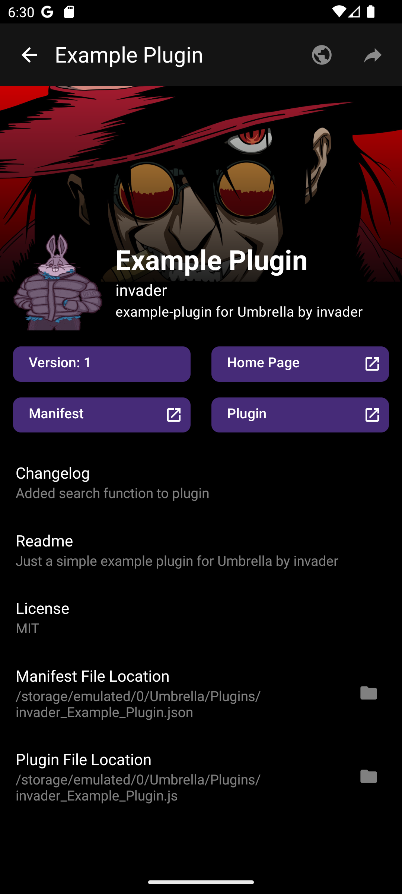           |
| Plugin List                                                                                              | Delete Plugin Dialog                                                                                 | Search Screen                                                                              | Search Screen More Modal                                                                     |
| 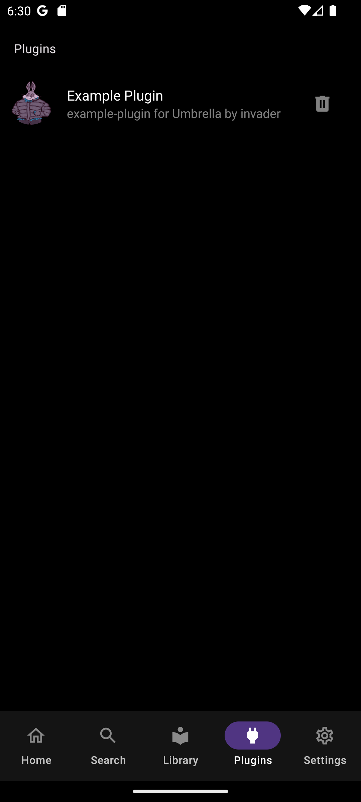                                    |                | 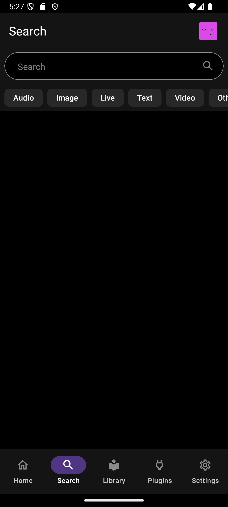                  | 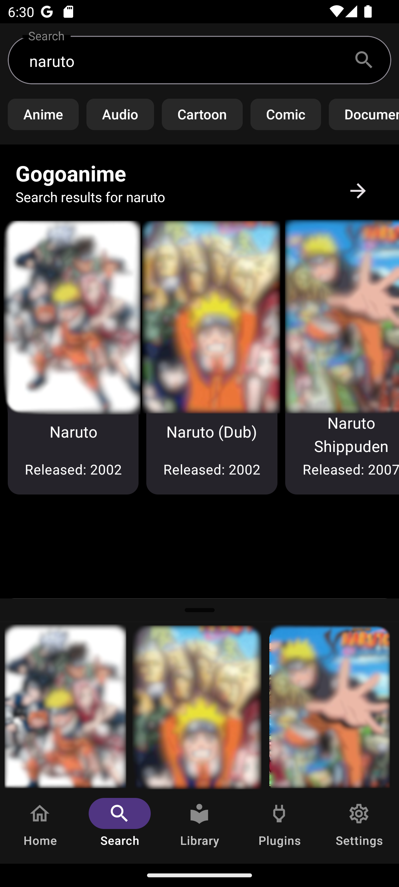    |
| Search Sreen More Modal (Fullscreen)                                                                     | Details Screen                                                                                       | Details Screen (Bottom)                                                                    | Home Screen (NYI)                                                                            |
| 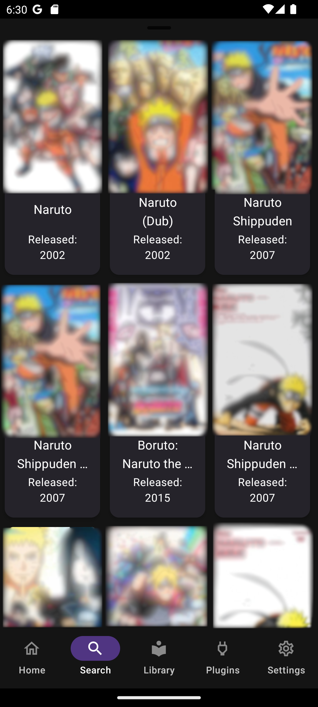 | 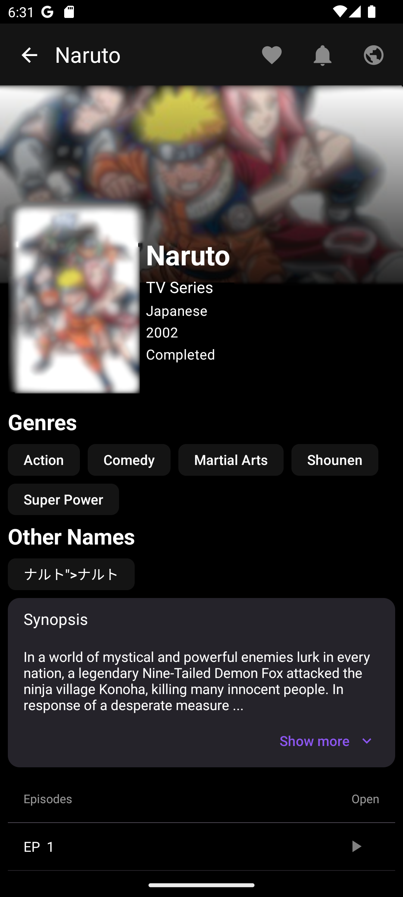                           | 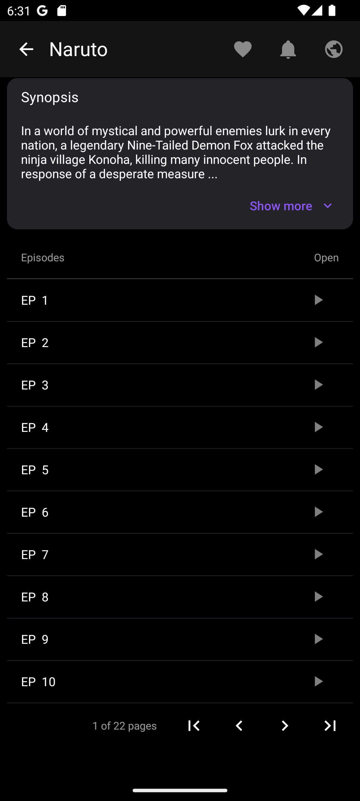 | 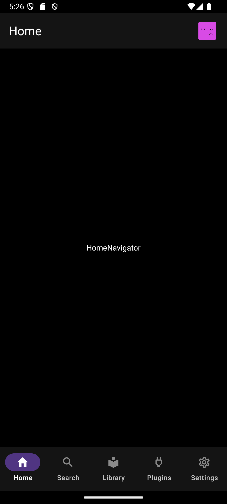 |
| Library Screen (NYI)                                                                                     | SettingsScreen (NYI)                                                                                 | Create Profile Screen                                                                      | Select Profile Screen                                                                        |
| 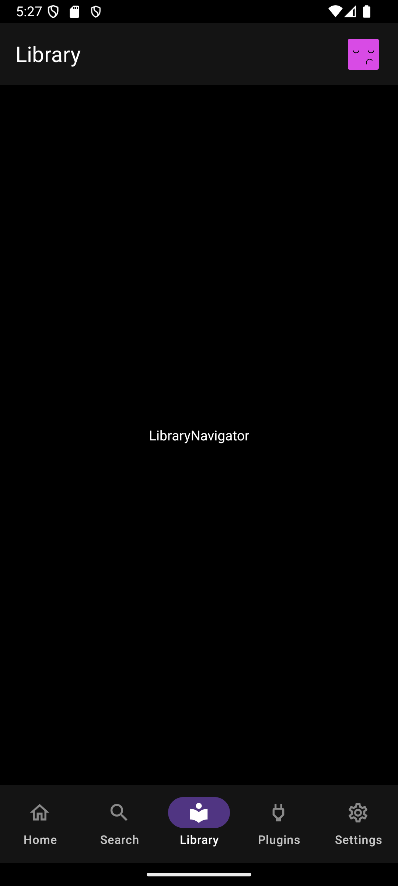       | 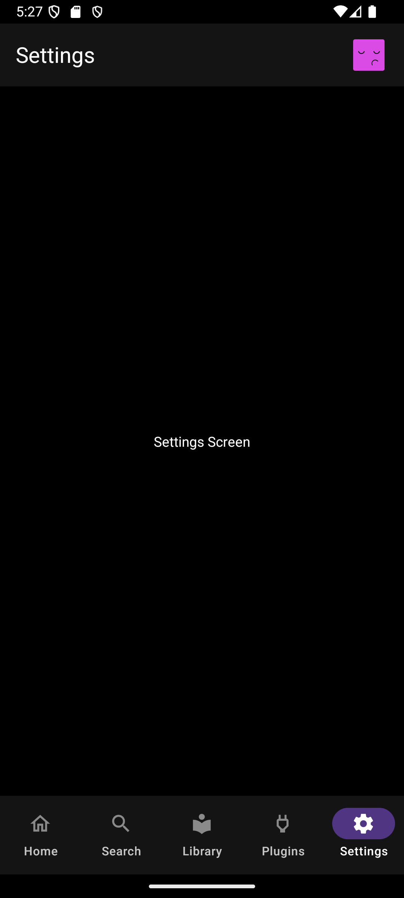 | 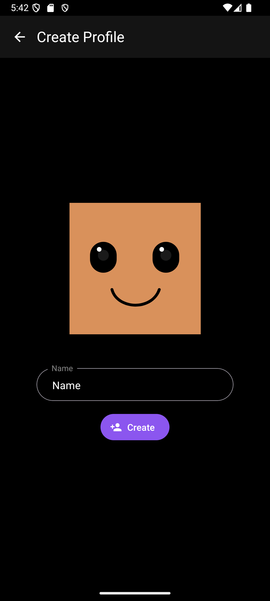  | 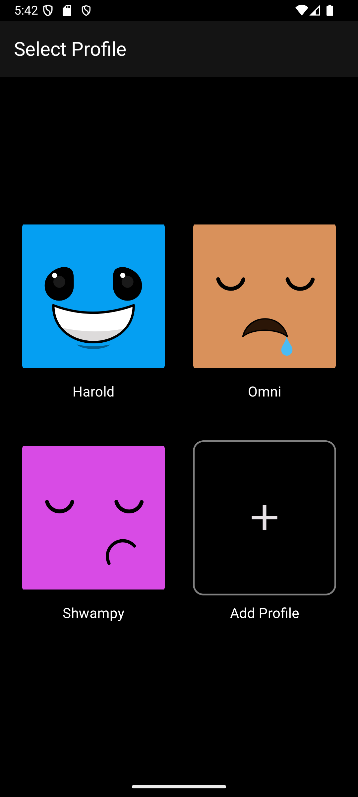    |

---

## 🏗️ Architecture

This project follows the **CLEAN + MVVM** pattern to ensure separation of concerns and modularity.

### **Core Layers**

1. **Presentation Layer (UI & Components)**
2. **ViewModel Layer (State & Business Logic)**
3. **Use Case Layer (Application-Specific Logic)**
4. **Data Layer (APIs, Local Storage, Plugins)**

### **Plugin System Overview**

- Plugins are downloaded as **JavaScript files** with a corresponding **manifest.json**.
- A **sandboxed Node.js runtime** executes plugin logic securely.
- Plugins provide methods that will fetch the media to be handled by the app.

---

## 🛠️ Installation & Setup

### **Prerequisites**

- Node.js & npm installed
- React Native
- Android emulator or physical device (IOS Not tested)

### **1️⃣ Clone the Repository**

```sh
git clone https://github.com/wuxnz/umbrella.git
cd umbrealla
```

### **2️⃣ Install Dependencies**

```sh
npm install
```

### **3️⃣ Set Up Nodejs Mobile**

```sh
cd nodejs-assets/nodejs-project
npx tsc
```

### **4️⃣ Run on Android Emulator (must open first)**

```sh
npx react-native run-android
```

---

## 🔌 How to Create a Plugin

### **Plugin Structure**

#### **Each plugin consists of:**

##### plugin.js: The main logic file (Plugin methods to be exported are defined in [ContentService.ts](plugin-example/src/models/ContentService.ts)).

###### **Plugin Info**

- Example of plugin layout can be found in [example-plugin-template.ts](plugin-example/src/example-plugin-template.ts).
- Return types and arguments for methods that must be implemented can be found in [ContentService.ts](plugin-example/src/models/ContentService.ts) (All types are in the [models](plugin-example/src/models) folder).
- Plugin class can implement any number of methods needed, but the only methods that will be ran in the sandbox are the predefined ones in [ContentService.ts](plugin-example/src/models/ContentService.ts).

##### manifest.json: Metadata defining plugin behavior and UI components (Deeplinks should point to this file using the "umbrella://" scheme. Refer to [index.html](plugin-example/test/index.html) and [manifest.json](plugin-example/test/manifest.json).

###### **Manifest Fields**

- sourceType (String): Type of source this manifest file points to (Types are defined in [SourceType.ts](plugin-example/src/models/source/SourceType.ts).
- author (String): The name/alias of the person making this plugin.
- name (String): Name of the plugin you are making.
- version (Int): Version number of the plugin (This will be used when checking for updates).
- description (String): Description of what your plugin does/provides.
- homePageUrl (String): Home page/Root route of the site your deeplink is located.
- iconUrl (String): Profile image url of the author (will be displayed in the Plugin related screens).
- manifestUrl (String): Link to the manifest.json file (This will be used along with the version field for checking for updates).
- pluginUrl (String): Link to your plugin.js file (Used to fetch the code for the the plugin).
- bannerImageUrl (String): Link to the image you want to be dispalyed as the plugin banner (Used in the plugin info view).
- changelog (String): This plugin version's changes from the previous version.
- readme (String): Any special info about/that is needed for using your plugin.
- license (String): License or Description for how or whether or not someone can share, edit, or sell your plugin.

#### **Example Plugin**

For an example of how a plugin file should be structured can be found in [example-plugin-template.ts](plugin-example/src/example-plugin-template.ts). Return types and arguments are defined in [ContentService.ts](plugin-example/src/models/ContentService.ts). You can implement other methods in the plugin class if needed, but all plugins should implement the methods in the [ContentService.ts](plugin-example/src/models/ContentService.ts) file.

### **Registering the Plugin**

1. Upload the plugin.js and manifest.json to a remote server (You can test with the "Live Server" VS Code extension).
2. Create a link to the plugin that points to the manifest.json file with the information to your plugin (Should follow the "umbrella://{url_to_manifest_file" pattern. Example can be found in [index.html](plugin-example/test/index.html)).
3. Click the link on the device that has the app installed and open in the background.
4. Click "Install" on dialog.
5. Check the "Plugins" page to see if your plugin has been installed and is working.

---

## 🔒 Security & Sandboxing

- Node.js-Mobile is used to create an isolated execution environment.
- Plugins run in a restricted sandbox with limited access to system resources.
- Data validation ensures plugins conform to expected behavior.

---

## 🤝 Contributing

### **We welcome contributions! To contribute:**

1. Fork the repository.
2. Create a new branch (feature-branch).
3. Make your changes and commit them.
4. Open a pull request.

---

## ⚠️ Disclaimer

### This project is intended for educational and research purposes only. I do not promote, encourage, or endorse piracy or any form of illegal activity. Users are solely responsible for how they use this software.

### **Fair Use Notice**

#### **Some features, such as web scraping, may involve retrieving publicly available data. Users must ensure they comply with the terms of service of any website they access. This project does not provide, store, or facilitate access to copyrighted or restricted content in any way.**

### **Third-Party Plugins & User Responsibility**

- **This application allows users to install and execute third-party plugins, which are not controlled or verified by me.**
- **I am not responsible for any damages, security risks, or data loss caused by third-party plugins.**
- **Users should exercise caution and verify the source of any plugin they install.**

### **Use at Your Own Risk**

#### **This software is provided "as is", without any warranties, express or implied. The author is not liable for any misuse, data loss, legal consequences, or damages resulting from the use of this software. Users assume full responsibility for their actions when using this project.**

---

## 📧 Contact

### For questions, feel free to reach out:

#### 📩 Email: softshoes67@gmail.com

#### 🌍 GitHub: wuxnz
